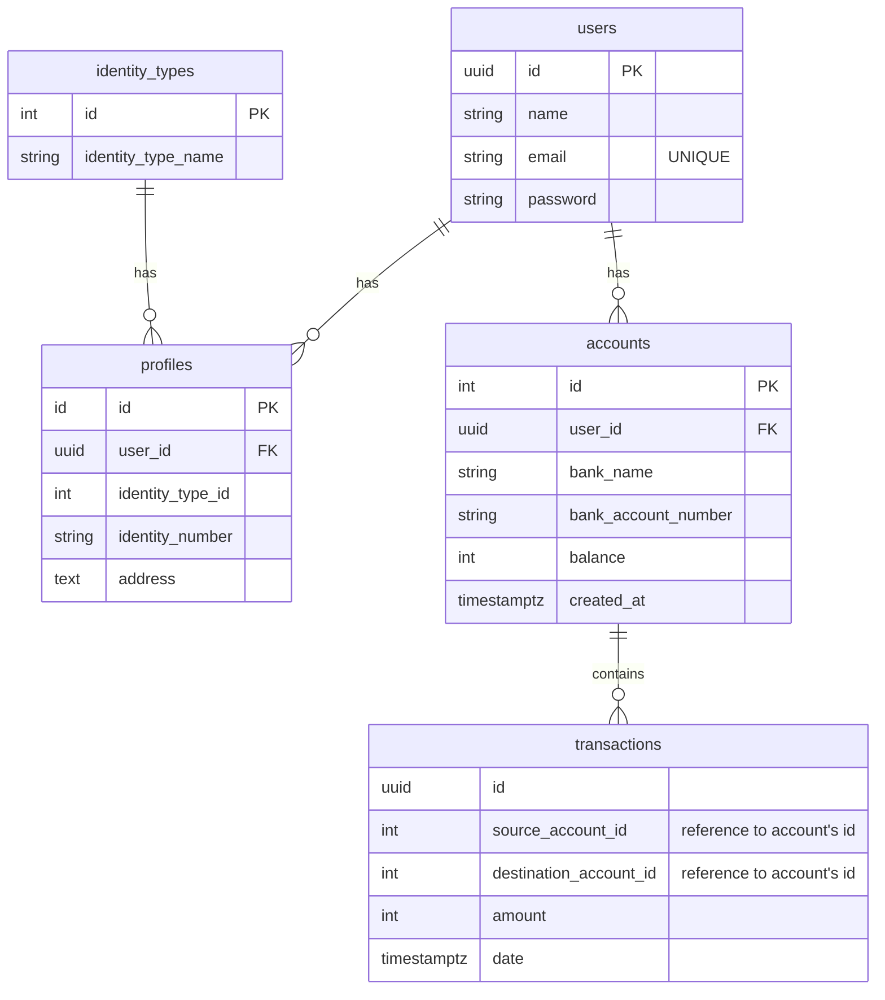

# Basic Banking System

## Brief Overview
It shows the different entities in the system, such as users, profiles, identity types, accounts, and transactions. Each entity is represented by a box or a table in the diagram.

The relationships between the entities are represented by lines or arrows. For example, a user can have multiple profiles and multiple accounts, and a profile is linked to a user via a foreign key.

Here's a description of the ERD with each entity and its attributes:

- users: Represents the users of the banking system. Each user has a unique ID (uuid id PK), a name (string name), an email (string email "UNIQUE"), and a password (string password).
- profiles: Represents additional details about each user. Each profile has an ID (id id PK), a user ID (uuid user_id FK), an identity type ID (int identity_type_id), an identity number (string identity_number), and an address (text address).
- identity_types: Represents the different types of identities that users can have. Each identity type has an ID (int id PK) and a name (string identity_type_name).
- accounts: Represents the bank accounts that users have. Each account has an ID (int id PK), a user ID (uuid user_id FK), a bank name (string bank_name), a bank account number (string bank_account_number), and a balance (int balance). 
- transactions: Represents the transactions made between accounts. Each transaction has a unique ID (uuid id), the source account ID (int source_account_id "reference to account's id"), the destination account ID (int destination_account_id "reference to account's id"), an amount (int amount), and a date (timestamptz date).