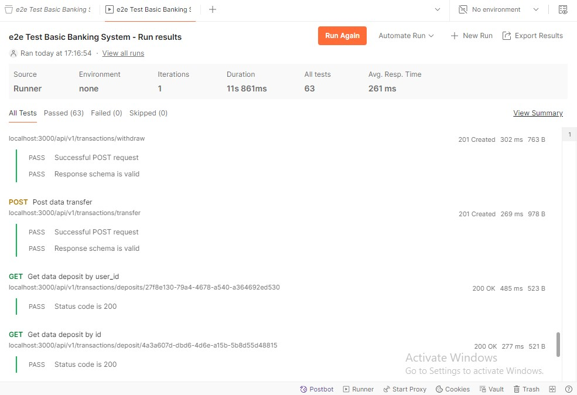

## How to use Automated API Testing in POSTMAN
** note: run this command if you want to do testing because some field and params using static value which is it will causes failed testing
>npx prisma db seed

1. press import button in menubar beside\
    
2. pop up windows will appears and press files as picture marked following:\
    
3. select the e2e test basic baking system and click open.\
    
4. new collection will appears in menu bar beside and select it\
    
5. press run in right top of app\
    
6. check persist response for a session for checking result of response\
    
7. and this is the display of the automated testing results\
    